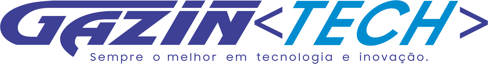

<h2 align="center">
2ª Talk Gazin Tech
</h2>

<h2 align="center">
    
</h2>

<br/>

<p align="center">
  

  
	
  <a href="https://www.linkedin.com/in/marcelogaldino/">
    
  </a>

  <a href="https://github.com/marcelogaldino/sendEmail/commits/master">
    
  </a>

  
   <a href="https://github.com/marcelogaldino/sendEmail/stargazers">
    
  </a>
</p>

<p align="center">
  <a href="#sobre-o-SendEmail">Sobre</a>&nbsp;&nbsp;&nbsp;|&nbsp;&nbsp;&nbsp;
  <a href="#rocket-Tecnologias">Tecnologias</a>&nbsp;&nbsp;&nbsp;|&nbsp;&nbsp;&nbsp;
  <a href="#como-usar--">Como usar</a>&nbsp;&nbsp;&nbsp;|&nbsp;&nbsp;&nbsp;
  <a href="#como-contribuir">Como contribuir</a>&nbsp;&nbsp;&nbsp;|&nbsp;&nbsp;&nbsp;
  <a href="#memo-license">License</a>
</p>


## Sobre o SendEmail

 O SendEmail foi desenvolvido para a 2ª edição da talk Gazin Tech squad Beserkers, afim de explicar como configurar um provedor de email fake para uso em localhost, além de desenvolver testes unitários para validar o envio do email 📬️ 💜.

## :rocket: Tecnologias

Este projeto foi desenvolvido com as seguintes tecnologias:

[NodeJS][nodejs] 💻 </br>
[Typescript][typescript] 📘 </br>
[Docker][docker] 🐳 </br>
[NodeMailer][nodemailer] 📬️ </br>
[Ethereal][ethereal] 🦆️ </br>

## Como usar ? 🤔

É necessário que você tenha algumas ferramentas instaladas antes de clonar este projeto. 

 - [Git](https://git-scm.com) 
 - [VSCode](https://code.visualstudio.com/) ou algum outro editor de sua prferência
 - [Node.js](https://nodejs.org/) (recomendado a versão LTS do site oficial) 
 - [NPM](https://www.npmjs.com/) ou [Yarn](https://yarnpkg.com/) como gerenciador de pacotes. *Ao instalar o **NodeJS** o **NPM** é instalado automaticamente*.
 - [Docker](https://www.docker.com/) **Recomendado**, mas não necessário. Este projeto possui suporte ao **Docker** o que facilita a configuração do nosso backend, por isso recomendamos 🐳


 ### Vamos começar!! ✍

Abra o terminal como administrador e clone o repositório:

```bash
# Clone o repositório
$ git clone https://github.com/marcelogaldino/sendEmail
```

## Rodando o backend da aplicação
É necessário abrir uma nova aba ou um novo terminal para este procedimento
```bash
# Vá para o diretório backend/
$ cd sendEmail
# Instale as dependências
$ yarn
# Subindo os containers docker da nossa aplicação
$ docker-compose up -d
# Verificando os nossos containers que estão rodando
$ docker ps #deve listar o container EMAIL
# Checando se nossa aplicação esta rodando corretamente 
$ docker logs email -f

# Caso tenha algum erro ao subir os containers docker use o comando abaixo para recria-los
$ docker-compose up --build --force-recreate
```
Neste momento temos a nossa aplicação com o backend e seus serviços em execução, com o backend rodando na porta 3333. *http://localhost:3333*

<div align="center">
 
[](https://insomnia.rest/run/?label=SendEmail&uri=https%3A%2F%2Fgithub.com%2Fmarcelogaldino%2FsendEmail%2Fblob%2Fmain%2FInsomnia-file)
</div>

## Como contribuir

- Faça um fork;
- Crie uma nova branch com a sua feature: `git checkout -b my-feature`;
- Commit as suas alterações: `git commit -m 'feat: My new feature'`;
- Empurre para o repositório remoto a sua nova branch: `git push origin my-feature`.

Abra um pull request para analisarmos as mudanças.

Você também pode nos ajudar abrindo issues.

## :memo: License

This project is under the MIT license. See the [LICENSE](https://github.com/marcelogaldino/sendEmail/blob/main/LICENSE) for details.


Made with ♥ by Marcelo Galdino :wave: [Get in touch!](https://www.linkedin.com/in/marcelogaldino/)

[typescript]: https://www.typescriptlang.org/
[nodemailer]: https://nodemailer.com/about/
[docker]: https://www.docker.com/
[nodejs]: https://nodejs.org/en/
[ethereal]: https://ethereal.email/

